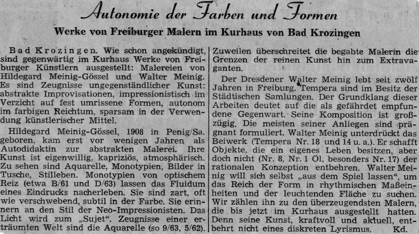

Walther Meinig wurde am **27.10.1902** in Dresden geboren. 

Nach dem Abitur erhielt er Privatunterricht bei den Dresdner Künstlern Franz Gaudeck (Radierung, Holzschnitt) und Paul Geissler (Zeichnen, Ölmalerei). **1927 – 1929** erfolgte das Studium an der Akademie der Bildenden Künste Dresden und die Teilnahme an den Ausstellungen des Kunstvereins Dresden.

Durch den Zweiten Weltkrieg und nachfolgende Kriegsgefangenschaft musste er seine künstlerische Tätigkeit von **1939 bis 1947** einstellen. Ab **1948** war Walther Meinig Mitglied der Dresdner Künstlergruppe *Das Ufer* und nahm an deren Ausstellungen teil. Zusammen mit Prof. Rudolf Bergander und Franz Nolde entstand hier das Großbild *Keramik Meißen* (4 x 5 Meter) in Gemeinschaftsarbeit. 

**1951** erfolgte die Berufung in die Landesgutachterkommission des VBK Sachsen. 
**1949** und **1952** erhielt er den Kunstpreis der Stadt Meißen.

Der repressiven dogmatischen Kulturpolitik des SED-Regimes entzog er sich **1952** durch Republikflucht und arbeitete bis zu seinem Tod am **29.12.1987** als freischaffender Maler in Freiburg im Breisgau. Bis 1972 beteiligte er sich regelmäßig an Ausstellungen des VBKW (Verband Bildender Künstler und Künstlerinnen Baden-Württemberg), unter anderem in Baden-Baden. 

Die Badische Zeitung kommt in einem Artikel über ihn und seine ebenfalls künstlerisch tätige Ehefrau Hildegard Meinig zu folgender Einschätzung:

